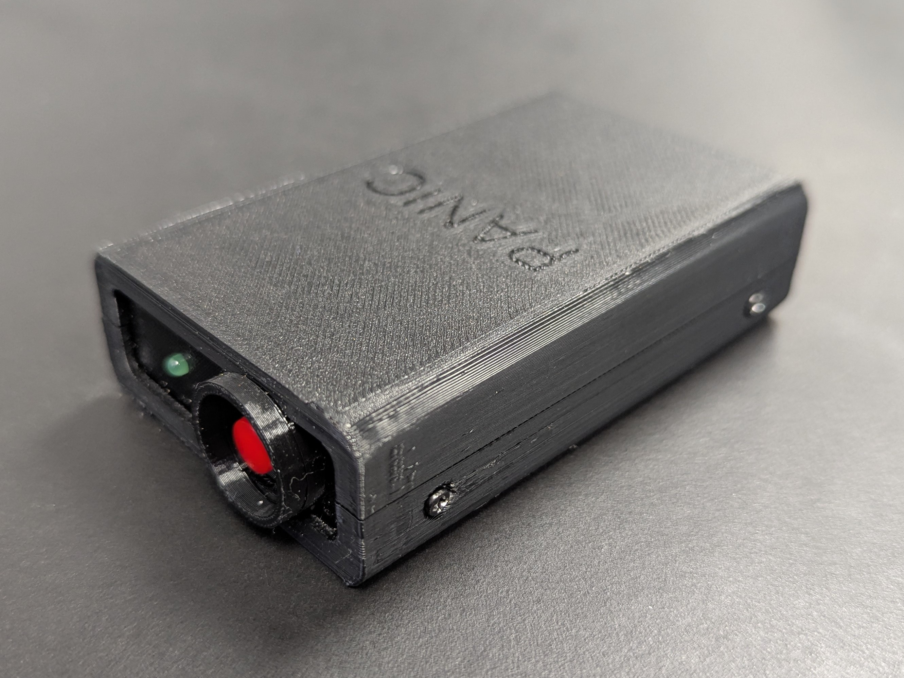
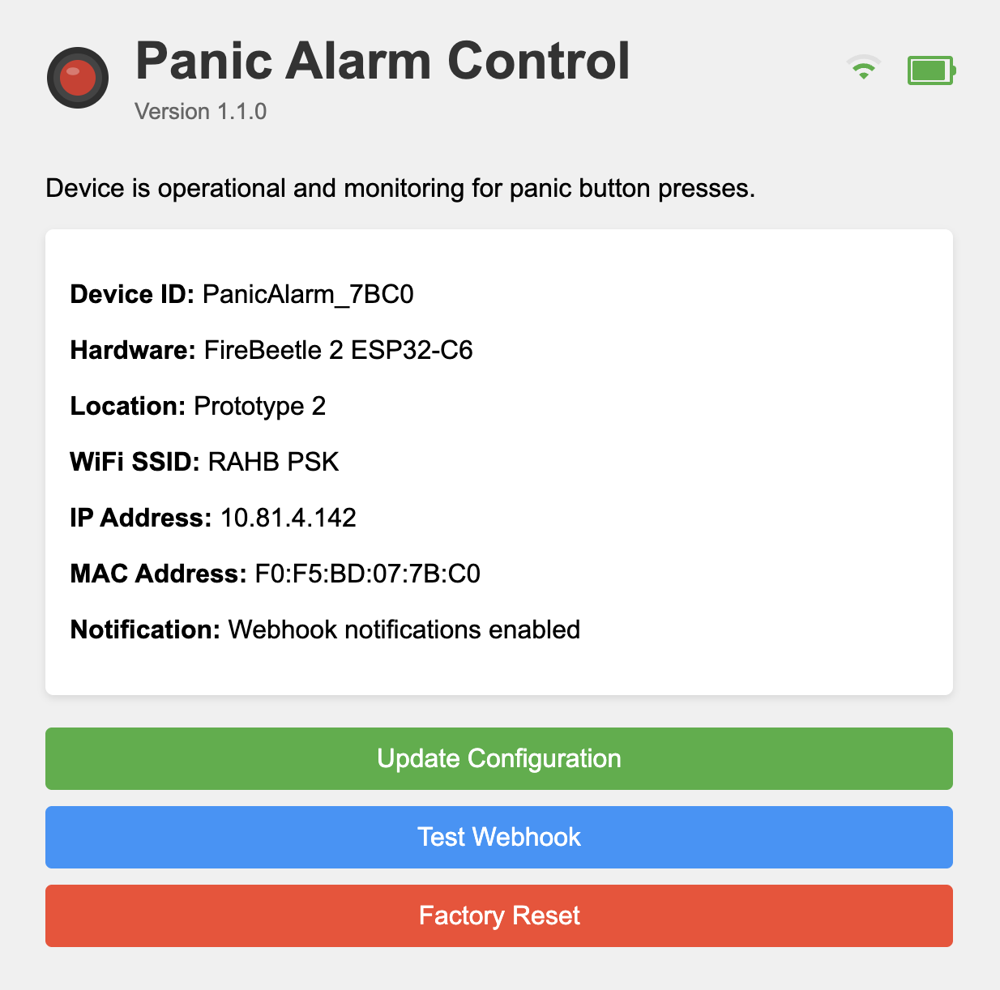
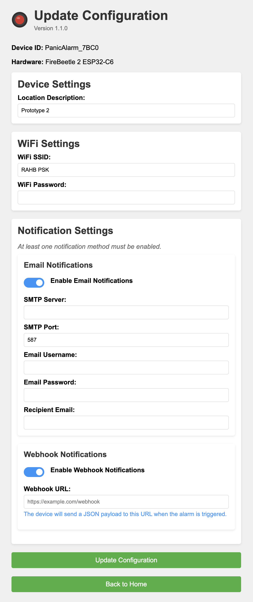

# 🔴 ESP32 Wi-Fi Panic Button

A standalone ESP32-based Wi-Fi panic button that sends email and/or webhook alerts when pressed. Designed for rapid deployment with a captive portal-based configuration interface, suitable for non-technical environments.

## 📚 Table of Contents

- [✨ Features](#-features)
- [🛠️ Hardware](#️-hardware)
- [🔌 Pinout](#-pinout)
- [📦 Libraries Used](#-libraries-used)
- [🚀 Getting Started](#-getting-started)
- [🔧 Web Interface](#-web-interface)
- [🔋 Battery Monitoring](#-battery-monitoring)
- [🌐 Webhook Integration](#-webhook-integration)
- [🔁 Resetting](#-resetting)
- [🖼️ UI Preview](#️-ui-preview)
- [🖨️ 3D-Printed Case](#️-3d-printed-case)
- [📄 License](#-license)

## ✨ Features

- Captive portal for Wi-Fi and alert configuration
- Email (SMTP) and/or webhook alerts when button is pressed
- EEPROM-stored settings with web-based update support
- Visual battery monitoring (gauge, percentage, and voltage)
- Responsive, mobile-friendly web interface
- Factory reset and test alert functionality
- Support for ESP32-C6 boards (like FireBeetle 2 ESP32-C6)
- Configuration validation to ensure at least one alert path is active

## 🛠️ Hardware

Optimized for:

### FireBeetle ESP32-C6
- [DFRobot FireBeetle 2 ESP32-C6 board](https://www.dfrobot.com/product-2771.html)
- Momentary push-button (GPIO 4)
- Onboard LED (GPIO 15)
- Battery voltage monitoring via A0 (GPIO 0)

## 🔌 Pinout

| Function       | GPIO Pin |
|----------------|----------|
| Panic Button   | 4        |
| Status LED     | 15       |
| Battery ADC    | 0        |

## 📦 Libraries Used

- [ESP Mail Client](https://github.com/mobizt/ESP-Mail-Client)
- HTTPClient (for webhook functionality)
- WiFi
- WebServer
- DNSServer
- EEPROM

## 🚀 Getting Started

1. Flash the firmware using the **Arduino IDE**
2. If no config is stored, the device starts in **Setup Mode**:
   - Hosts an AP named `PanicAlarm_XXXX` (XXXX is part of the MAC address)
   - Password: `setupalarm`
   - Captive portal guides you through configuration
3. Once configured, the device connects to your Wi-Fi and enters **Normal Mode**

## 🔧 Web Interface

### Setup Mode
- Captive portal with pages for Wi-Fi, SMTP, webhook, and location setup
- Device enters this mode if config is missing or reset

### Normal Mode
- Live status dashboard with battery gauge and diagnostics
- Config page for updating any setting
- Alert testing tools for both email and webhook
- Factory reset with confirmation

## 🔋 Battery Monitoring

- Visual gauge with color coding:
  - Green: > 50%
  - Yellow: 25–50%
  - Red: < 25%
- Live percentage and voltage display
- Low battery alerts via email/webhook (if enabled)

## 🌐 Webhook Integration

Webhook alerts are JSON payloads with:
- `event` (e.g. `"panic_triggered"` or `"battery_low"`)
- `device_id`, `location`
- `battery_level`, `voltage`
- `ip`, `mac`
- `timestamp`

## 🔁 Resetting

Access the reset page via the web UI to:
- Clear all config (Wi-Fi, SMTP, webhook, location)
- Restart in Setup Mode

## 🖼️ UI Preview

## 🖨️ 3D-Printed Case

This project includes a printable enclosure tailored for the FireBeetle ESP32-C6. All STL and 3MF files are located in the `case/v1/` directory:

- `panic_button_case.3mf` – complete project layout for slicers
- `case_back.stl`
- `case_bottom.stl`
- `case_front.stl`
- `case_top.stl`

### Recommended Slicer Settings

- **Material:** PLA, PETG, or similar
- **Layer Height:** 0.2 mm
- **Infill:** ≥ 15%
- **Supports:** Optional (recommended for top-bottom half alignment when screwed together)
- **Perimeters/Walls:** 2 or 3

The top and bottom shells include simple interlocking features. Use supports only if dimensional accuracy matters for your use case.

## 📄 License

GPLv3 – see [LICENSE](LICENSE) for details.
